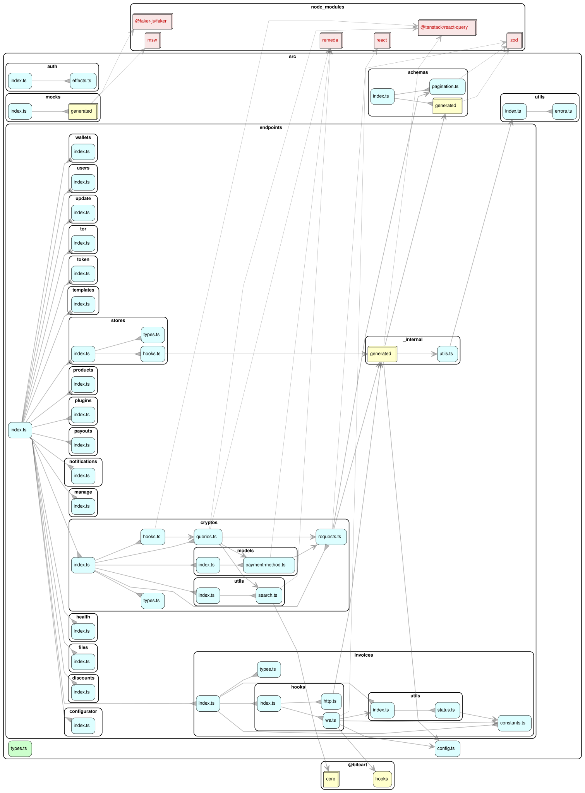

# Bitcart API SDK

TypeScript SDK for the Bitcart Merchants API.

## Mocking

`msw` and `@faker-js/faker` back the generated request handlers behind the `@bitcart/api-sdk/mocks`
entry point, and nothing else in the SDK imports them. They are declared as optional peers so that
consumers that never touch that entry point don't carry a mocking stack into their production
install closure. Install both alongside the SDK to use it:

```sh
just add-dev <ws-member> msw
just add-dev <ws-member> @faker-js/faker
```

## Architecture

### Dependency graph


