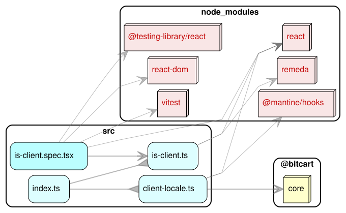

# Bitcart React Hooks

React hooks for applications and websites under the Bitcart umbrella.

This package holds framework- and presentation-agnostic, SSR-safe React hooks (e.g. `useIsClient`). UI-specific hooks live in `@bitcart/ui-kit`, and Vike/runtime-specific hooks live in `@bitcart/vike-kit`.

## Architecture

### Dependency graph

