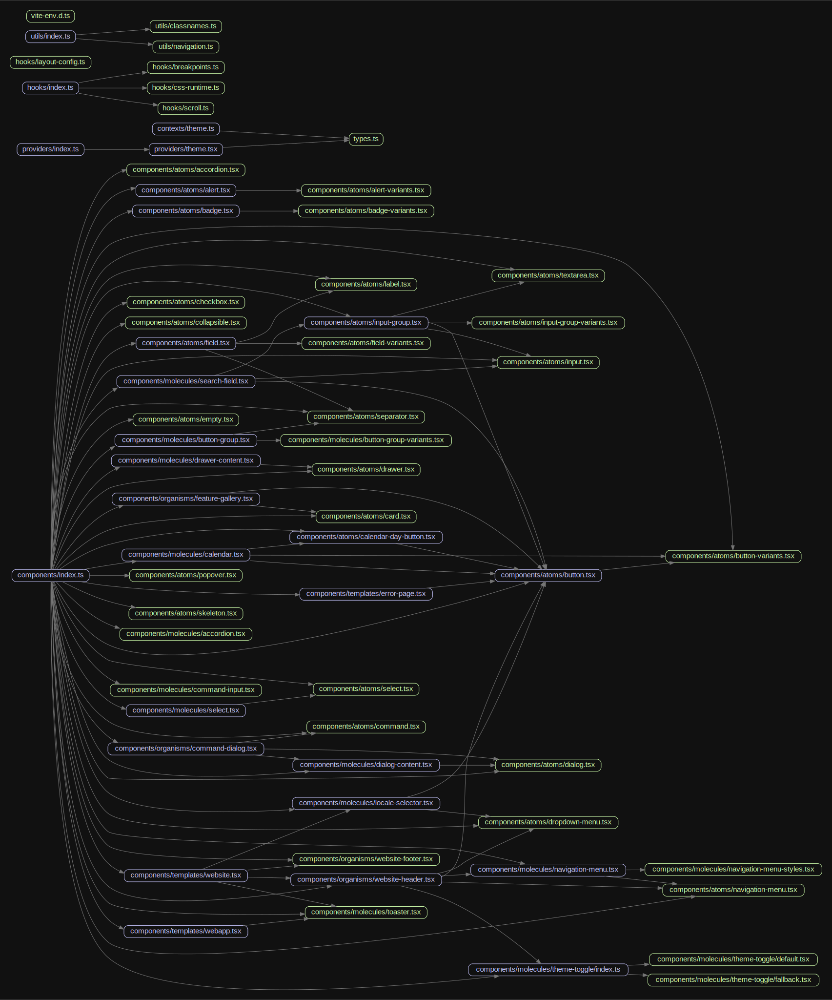

# Bitcart UI Kit

UI development kit for applications and websites under the Bitcart umbrella.

## Styles

When using this package standalone (i.e. outside of its original monorepo),
make sure to import the styles at the root level of the application layout:

```ts
import "@bitcart/ui-kit/styles"
```

## Architecture

### Dependency graph


