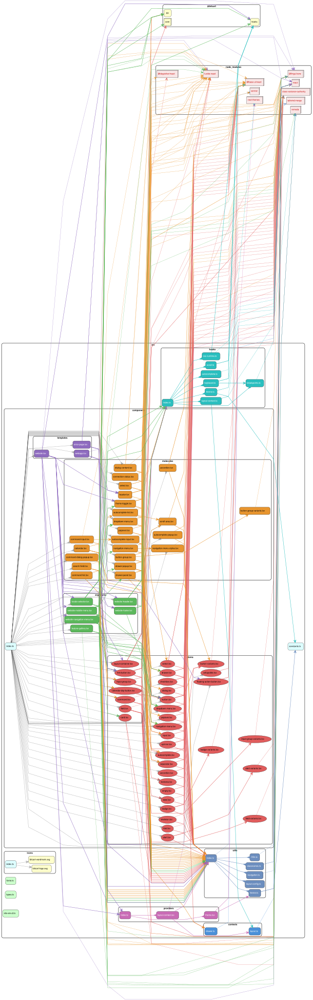

# Bitcart UI Kit

UI development kit for applications and websites under the Bitcart umbrella.

## Usage

### Styling

For the styling layer, this package relies on a combination of [UnoCSS](https://github.com/unocss/unocss) with a custom UnoCSS preset, packaged as `@bitcart/unocss-preset`. Consequentially, any consumer app must adhere to the same configuration baseline. If required, alternative styling solutions can be used alongside it, as long as they don't collide with the Tailwind CSS scope, which is already handled by the aforementioned preset.

When using this package as an app dependency within the original monorepo, make sure to configure UnoCSS to scan its source files by listing them in the `cli.entry.patterns` array:

```ts
export default defineConfig({
  cli: {
    entry: {
      patterns: ["src/**/*.tsx", "../../packages/ui-kit/src/**/*.tsx"],
      outFile: "src/pages/uno.generated.css",
    },
  },

  presets: [
    presetBitcart(),
    /* Optionally, other UnoCSS presets */
  ],
})
```

The same pattern applies when using this package standalone (i.e. outside of its original monorepo):

```ts
export default defineConfig({
  cli: {
    entry: {
      patterns: ["src/**/*.tsx", "node_modules/@bitcart/ui-kit/src/**/*.tsx"],
      outFile: "src/pages/uno.generated.css",
    },
  },

  presets: [
    presetBitcart(),
    /* Optionally, other UnoCSS presets */
  ],
})
```

## Development

### Architecture

#### Component classification

This package shapes its component hierarchy, composition, and colocation rules around a modified version of the [Atomic Design](https://atomicdesign.bradfrost.com/chapter-2) methodology. It keeps the same four base categories but sorts components primarily by composition complexity and dependency flow rather than by visual scale:

- **Atoms**: single-responsibility building blocks, such as styled native elements or thin wrappers around individual headless primitives (e.g. triggers, basic inputs, separators, stack item wrappers, or bare portal / backdrop / positioner parts).
- **Molecules**: assemblies that compose atoms into self-contained functional surfaces with opinionated defaults.
- **Organisms**: complex, multifaceted interface fragments built from molecules and atoms, ready to be wired into application layout, data contexts, and business logic.
- **Templates**: top-level layout abstractions that arrange lower-tier components into complete page shells.

**Compound primitives are split across tiers.** Per the definitions above, a primitive's individual parts and its assembled surface fall under different categories, so the same namespace can span across category folders (e.g. `PopoverTrigger` and `PopoverBackdrop` as atoms, `PopoverContent` as a molecule).

**Source specification fallback**: a custom variation of a generic third-party primitive that adds no local composition is classified by Atomic Design's original visual-first reasoning instead, when its internal implementation and visual layout are too complex for the atom category.

**Dependency flow.** The categories form a strict, acyclic hierarchy, and dependencies only ever flow downward: templates → organisms → molecules → atoms. Intra-category dependencies are allowed only when they don't raise a component's tier, in two forms: **specialization**, deriving a preset variation of a sibling (e.g. `CalendarDayButton` from `Button`), and **structural reuse**, embedding a sibling utility such as `ScrollArea` or `Separator` to fulfil the component's own role. Composing sibling _features_ into a new, more capable unit is not intra-category and belongs one tier up.

**Colocation.** Implementation details external to the component definition itself (e.g. variant and style definitions) live in sibling modules, so each component file exports React components only, as required by React Fast Refresh.

#### Dependency graph


