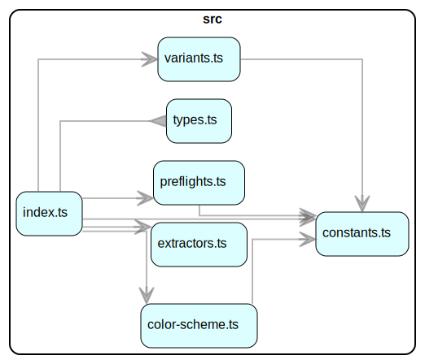

# Bitcart UnoCSS Preset

UnoCSS preset for applications and websites under the Bitcart umbrella.

## Usage

Just import and use the preset in your `uno.config.ts` file, listing it at the first position of the `presets` array.

> ⚠️ The preset already incorporates the [Wind4](https://unocss.dev/presets/wind4), [Shadcn](https://github.com/unocss-community/unocss-preset-shadcn), [Typography](https://unocss.dev/presets/typography), and [Animations](https://unocss-preset-animations.aelita.me/) presets. Do not add them manually.

```typescript
import { presetBitcart } from "@bitcart/unocss-preset"
import { defineConfig } from "unocss"

export default defineConfig({
  presets: [
    presetBitcart(),

    /*
      Other UnoCSS presets...
    */
  ],
})
```

## Architecture

### Dependency graph


